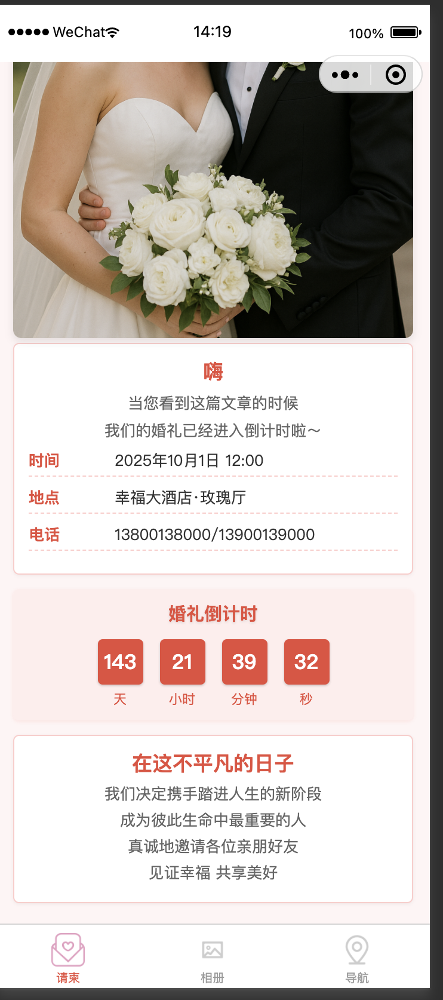

# 婚礼邀请函微信小程序

由于婚礼纪的请柬不符合我的需求，而我作为一个程序员又不想妥协，所以我就写了一个自己的婚礼请柬小程序，整体代码风格通俗易懂，请按照readme.md的文档修改即可配置成专属于自己的婚礼请柬了

这是一个为婚礼设计的微信小程序，包含邀请函、婚纱相册和婚礼地点导航等功能。

## 预览





## 功能特点

- **婚礼邀请函**：展示新人姓名、婚礼时间地点等基本信息
- **婚纱相册**：轮播图和照片墙展示婚纱照，支持图片预览
- **婚礼导航**：地图展示婚礼地点，支持导航、地址复制和电话拨打
- **倒计时组件**：显示距离婚礼的倒计时
- **自定义导航栏**：适配不同设备的导航栏
- **分享功能**：支持分享到朋友圈和好友

## 项目结构

```
.
├── app.js                # 小程序入口文件
├── app.json              # 小程序全局配置
├── app.wxss              # 全局样式
├── project.config.json   # 项目配置文件
├── components/
│   ├── countdown/        # 倒计时组件
│   └── navigation-bar/   # 自定义导航栏组件
├── images/               # 图片资源
└── pages/
    ├── album/            # 婚纱相册页面
    ├── index/            # 首页/邀请函页面
    └── map/              # 婚礼地点导航页面
```

## 使用说明

1. 克隆或下载项目代码
2. 使用微信开发者工具导入项目
3. 修改以下文件中的个人信息：
   - `project.config.json` - 修改appid为您的小程序appid
   - `pages/index/index.js` - 修改新人姓名、婚礼时间地点等信息，替换分享图片链接
   - `pages/album/album.js` - 更新婚纱照片链接：
   - `pages/index/index.wxml` - 更新首页封面图片：
   - `pages/map/map.js` - 更新婚礼地点坐标和地址
4. 在微信开发者工具中预览和发布
5. 删除imges/examples文件夹中的小程序截图
6. 上传代码到微信小程序后台进行审核和发布

## 配置要求

- 微信开发者工具
- 微信小程序账号
- 基础库版本建议2.10.0以上

## 注意事项

- 地图页面需要配置正确的经纬度坐标
- 相册图片需要上传到可访问的CDN或服务器,这里我使用的是火山引擎的对象存储，
  如果你使用其他的存储服务，请确保图片链接是公开可访问的(主要是因为希望分辨率更好一些，小程序规定了小程序整体的大小限制)
- 分享到会话和朋友圈都配置好了，需要关闭的可以参考小程序开发者平台文档
- 如果有问题请提issue更正哈


## 许可证

MIT License
